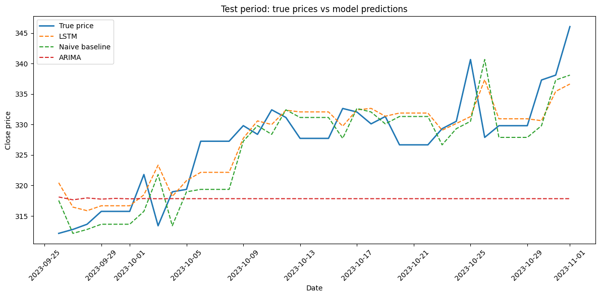

# Stock Price Prediction using LSTM and Classical Time-Series Models

This project explores short-term stock price prediction using a simple LSTM model and compares it with two classical baselines:  
a naive persistence model and an ARIMA time-series model.  
The goal is to see whether an LSTM actually provides a meaningful improvement over simpler forecasting approaches on daily MSFT prices.

This work was done as part of my learning process in time-series forecasting and machine learning.

---

## 1. Research Question
**Do LSTM-based models provide a statistically meaningful improvement over simple time-series baselines (naive & ARIMA) for short-term stock price prediction?**

---

## 2. Dataset
- **Ticker:** MSFT (Microsoft)  
- **Type:** Daily historical stock prices  
- **Columns used:** Date, Close  
- **Period:** November 2022 → November 2023  
- Stored in: `data/MSFT.csv`

Only the closing price is used to keep the project focused and understandable.

---

## 3. Methodology

### **Data Preparation**
- Converted dates to datetime and indexed by date  
- Created windowed sequences with a **3-day look-back**  
- Splits:  
  - 80% training  
  - 10% validation  
  - 10% testing  

### **Models**
- **LSTM**
  - Input: (3 timesteps × 1 feature)  
  - Layers: LSTM(64) → Dense(32) → Dense(32) → Dense(1)  
  - Trained for 100 epochs  
- **Naive baseline:**  
  - Predicts tomorrow’s price as today’s price  
- **ARIMA baseline:**  
  - Searched over a small manual set of (p,d,q) values  
  - Selected the best model using AIC  

### **Evaluation Metrics**
- RMSE  
- MAE  
- MAPE  
- Directional Accuracy (predicting up/down correctly)  

---

## 4. Results

Below is the comparison table (generated by the notebook):

| Model           | RMSE | MAE | MAPE (%) | Directional Accuracy (%)    |
|-----------------|------|-----|-----------|----------------------------|
| LSTM            | 4.57 | 3.56| 1.09      | 55.55                      |
| Naive baseline  | 5.02 | 4.01| 1.22      | 63.88                      |
| ARIMA           | 11.92|10.35| 3.13      | 30.55                      |


---

### Example Test Plot  
The notebook also includes a visual comparison showing:

- True MSFT prices  
- LSTM predictions  
- Naive predictions  
- ARIMA predictions  




---

## 5. Discussion

The LSTM achieves the lowest error metrics (RMSE: 4.57, MAE: 3.56, MAPE: 1.09%) compared to both baselines, demonstrating its ability to capture temporal patterns in price data. However, the results reveal an important nuance in financial forecasting.

**Key Finding:** While the LSTM has lower prediction error, **the naive baseline outperformed it in directional accuracy** (63.88% vs 55.55%). This highlights a crucial insight — **lower prediction error doesn't necessarily translate to better trading signals**. In finance, knowing whether a price will go up or down often matters more than predicting the exact value.

The naive model's "predict tomorrow = today" strategy works surprisingly well because stock prices exhibit short-term momentum. This is a common phenomenon in financial time series and explains why simple baselines can be highly competitive in stock forecasting tasks.

**ARIMA Performance:** The ARIMA model performed significantly worse (RMSE: 11.92), likely due to:
- Training on windowed target sequences rather than raw prices (creates artificial structure)
- Limited hyperparameter search  
- Stock prices may not satisfy ARIMA's stationarity assumptions well

A fairer ARIMA comparison would involve training on raw close prices with proper differencing and seasonal decomposition.

**Takeaways:**  
This experiment demonstrates that while LSTMs can reduce prediction error, beating simple baselines for *actionable* stock predictions remains challenging. It reinforces the importance of:
- Always including baseline comparisons in model evaluation
- Choosing metrics that align with the actual use case  
- Understanding that academic performance metrics may not reflect practical utility
- Being honest about model limitations

Stock price forecasting is inherently difficult, and results depend heavily on data quality, feature engineering, and modeling choices. This project illustrates both the potential and limitations of applying deep learning to financial time series.

---

## ⚠️ 6. Limitations

- Only **one stock (MSFT)** over a relatively short period  
- Only the **closing price** was used (no volume, indicators, etc.)  
- Hyperparameters for both LSTM and ARIMA were tuned in a simple way  
- Evaluation is limited to **one-day-ahead prediction**  
- Windowed target series creates an artificial daily frequency for ARIMA  

These limitations are normal for a student-level project and leave space for further experimentation.

---

## 7. Future Work
Potential improvements and experiments:

- Add features such as volume, returns, volatility measures, technical indicators  
- Try other architectures: **GRU**, **TCN**, **1D CNN**, **Transformer**  
- Perform **walk-forward validation** instead of simple splits  
- Predict multiple steps ahead (e.g., 3 or 5 days)  
- Train ARIMA on the raw close-price series instead of windowed targets  

---

## 8. How to Run

Install dependencies:

```bash
pip install -r requirements.txt
```

Open the notebook:

```
notebook/Stock_Price_Prediction_LSTM.ipynb

```

Run all cells from top to bottom.

---

## 9. Project Structure

```
Stock-Price-Prediction-LSTM/
│
├── data/
│   └── MSFT.csv
│
├── notebook/
│   └── Stock_Price_Prediction_LSTM.ipynb
│
│
├──  figures/          
│   └── comparison_plot.png
│
├── README.md
└── requirements.txt
```
